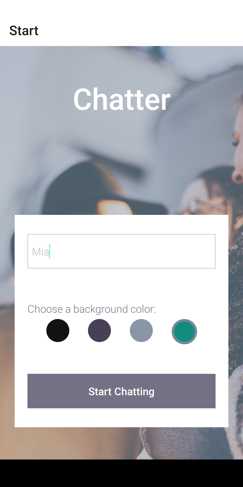
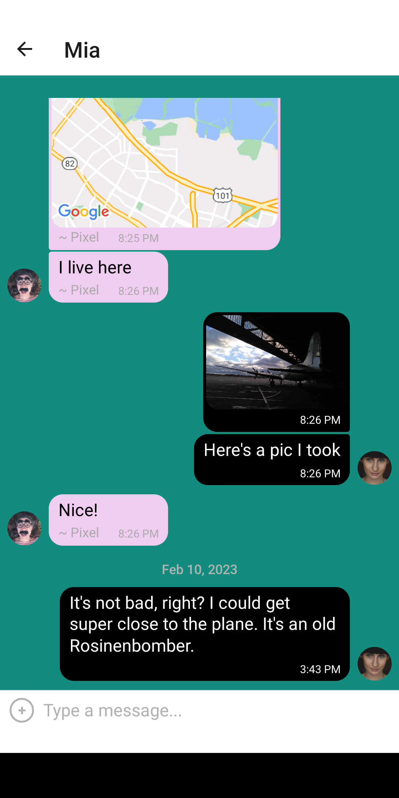

# Chatter

Chatter away with Chatter the chat app.

Built with React Native and Expo.

## Features

Chatter is a single-room chat application that runs on Android and iOS.

You can pick a username and background color.

Then, with your friends in real-time, you can:

- Send messages
- Send images (either from storage or taken directly with your device's camera)
- Share your location

## Screenshots

## Run locally

You can run Chatter on your device using the [Expo Go app](https://expo.dev/client). You could also use a simulator like Android Studio if you wanted to.

This requires you to build the app on a machine that is somehow connected to your device (e.g. connected to the same WiFi network).

To build the app:

0. Make sure you have [Node.js](https://nodejs.org) installed
1. Clone the [Chatter repository](https://github.com/jamkerr/chatter)
2. Navigate to the project folder and run `npm install`
3. Run `npm start`
4. Either scan the QR code with your device using the [Expo Go app](https://expo.dev/client), or type `a` in your console to build the project for e.g. Android Studio
5. You should now be running Chatter!

## Database

Chatter uses [Firebase](https://firebase.google.com/) to store messages and media content.

The repository comes with connection to a demo Firebase database, but to connect to your own, simply edit `firebaseConfig` in `components/Chat.js`.
